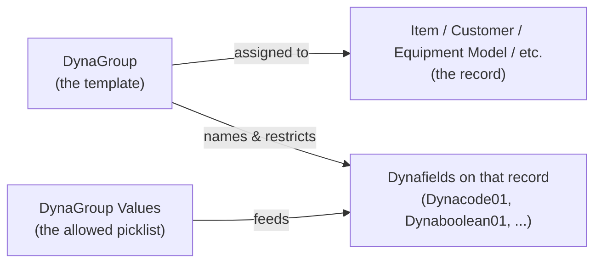

# DynaGroups and Dynafields

## What are DynaGroups and Dynafields?

A **DynaGroup** is a reusable "label sheet" that names a set of extra fields (like
"Color", "Warranty Type", "Is Refrigerated"). A **Dynafield** is one of those extra fields
as it actually appears on a real record — for example, on an Item card. When you assign a
DynaGroup to a record, its Dynafields "borrow" the names from that DynaGroup and,
for some field types, only let you pick from an approved list of values. Change the
DynaGroup, and the same fields relabel themselves and offer a different list — no new
fields, no development work required.

## Why does this exist?

Different product lines need different extra information. A tire needs a "Tread Pattern"
field; a generator needs a "Fuel Type" field. Instead of building a brand-new field for
every possible attribute, the system gives every Item (and Customer, Equipment Model,
Rental Configuration, Maintenance Contract, etc.) a fixed set of general-purpose "slots".
A DynaGroup decides what each slot is *called* and *what's allowed in it* for a
particular product line — the slots themselves never change.

## The three building blocks

1. **DynaGroup** — the template. It has a `Code` (e.g. `TIRES`), a `Description`, and
   named "slots" grouped by type (see below). Setup pages: **DynaGroup List** /
   **DynaGroup Card**.
2. **DynaGroup Values** — the picklist of allowed entries for each slot of a DynaGroup
   (e.g. slot "Option 1" of `TIRES` allows `RADIAL`, `BIAS`). Maintained on the
   **DynaGroup Value Worksheet** — see the companion guide,
   [Dyna Group Value Worksheet](DynaGroupValueWorksheet.md).
3. **Dynafields** — the actual fields you see and fill in on a record's card (Item,
   Customer, Equipment Model, ...). They're always there, but they only make sense once a
   DynaGroup is assigned — the DynaGroup tells them what to be called and what values to
   accept.

## Where do DynaGroups get assigned?

A record gets one DynaGroup assigned through a **DynaGroup** field on that record. Once
assigned, all the Dynafields on that record use that DynaGroup's slot names and picklists.
Records that support this today include:

- Items (and Item Templates)
- Customers
- Equipment Models (and Equipment Objects, which inherit from their model)
- Rental Configurations / Requested Rental Configurations / Rental Contracts
- Maintenance Contracts, Maintenance Contract Types, Maintenance Price Headers
- Claims

Use the **DynaGroup - Where Used** factbox on the Dyna Group Value Worksheet to see, for a
specific Dyna Group, exactly which of these tables currently reference it.

## What kinds of Dynafields are there?

Every record that supports Dyna Groups exposes the same fixed set of slots. A Dyna Group
only needs to name the slots it actually uses — leave the rest blank and they simply won't
show up as usable options.

| Slot type | Example field names on a record | What it's for | Restricted to a picklist? |
|---|---|---|---|
| **Code options** (Option 1–9) | `Dynacode01`–`Dynacode09` | Short codes with a controlled list of choices | Yes — via Dyna Group Values |
| **Free text options** (Option 10–34) | `Dynacode10`–`Dynacode34` | Free-form short text, no controlled list | No |
| **Booleans** (Boolean Option 1–5) | `Dynaboolean01`–`Dynaboolean05` | Simple yes/no switches | No — it's just a checkbox |
| **Decimals** (Decimal Option 1–9) | `Dynadecimal01`–`Dynadecimal09` | Numeric values (2 decimal places) | No |
| **Dates** (Date 1–6) | — | Date values | No |
| **Selection Decimals** (Selection Decimal 1–9) | — | Numeric values with a controlled list | Yes — via Dyna Group Values |
| **Equipment Model options** (Equipment Model Option 1–9) | — | Same idea as Code options, but a separate range reserved for Equipment Models | Yes — via Dyna Group Values |

> The naming ("Option 1", "Dynacode01", etc.) is purely internal plumbing. What the user
> actually sees is whatever caption you typed into that slot on the Dyna Group Card — see
> the next section.

## The "magic" behind the relabeling

This is the part that looks like magic but is just a lookup:

1. On the **Dyna Group Card**, you type a name into a slot — e.g. Option 1 = `Color`.
2. On the record (say, an Item), the corresponding Dynafield (`Dynacode01`) is wired to
   read its on-screen label from whichever Dyna Group is assigned to that Item.
3. So the same physical field shows as **"Color"** on a paint-related Item, and as
   **"Fuel Type"** on a generator Item that uses a different Dyna Group — because each
   Item points at a different Dyna Group.

For **Code options** and **Selection Decimals**, the same trick also restricts which
values you're allowed to type: the field's lookup is filtered to only the
**Dyna Group Values** entries recorded for that specific slot of that specific Dyna Group.
Pick a different Dyna Group and you get a different label *and* a different picklist.

**Free text, Boolean, and Decimal** slots are only relabeled — they never restrict the
value you can enter, since there's no matching Dyna Group Values picklist for them.

## Special case: Equipment Models

Equipment Models use a dedicated range of slots (labeled "Equipment Model Option 1"
through "Equipment Model Option 9") instead of the regular Option 1–9 range. This keeps
Equipment Model attributes from colliding with, for example, Item attributes even when
both happen to share the same Dyna Group. You don't need to do anything differently — the
**Dyna Group Value Worksheet** and **DynaField Factbox** already show these as clearly
labeled "Equipment Model Option" entries.

## Setting things up end to end

1. **Create the Dyna Group.** Open the **Dyna Group List**, create a new Dyna Group with
   a `Code` and `Description`.
2. **Name the slots you need.** On the **Dyna Group Card**, fill in only the slots that
   are relevant (e.g. Option 1 = `Color`, Boolean Option 1 = `Is Refrigerated`). Leave
   everything else blank.
3. **Define the allowed values (Code options, Selection Decimals, and Equipment Model options).** Use the
   **Dyna Group Value Worksheet** to add the picklist entries for each named slot (e.g.
   `Color` → `RED`, `BLUE`, `GREEN`).
4. **Assign the Dyna Group to a record.** On the Item, Customer, Equipment Model, etc.,
   set the **Dyna Group** field to the Dyna Group you just built.
5. **Fill in the Dynafields.** The Dynafields on that record now show your custom labels;
   Code option, Selection Decimal, and Equipment Model option fields restrict input to the values from step 3.

## Frequently Asked Questions

**Q: I renamed a slot on the Dyna Group Card. Does that change historical data?**
No — renaming only changes the caption shown to users. The underlying value stored on the
record doesn't change.

**Q: Can two different records (e.g. an Item and a Customer) use the same Dyna Group?**
Yes. A Dyna Group is just a shared template — any number of records can point at the same
one and they'll all show the same slot names and picklists.

**Q: I assigned a Dyna Group but the Dynafields still show generic names like "Dynacode01".**
Check that the corresponding slot (e.g. Option 1) actually has a name typed in on the
Dyna Group Card. A blank slot name falls back to the generic internal field name.

**Q: Why can't I type just anything into a Dynacode field?**
Code option and Selection Decimal fields are deliberately restricted to the values defined
in the **Dyna Group Value Worksheet** for that slot — this keeps the picklist consistent
across everyone using the same Dyna Group. If you need a genuinely free-form field, use
one of the Free text option slots (Option 10–34) instead.

**Q: How do I find out which slots are actually defined for a Dyna Group before I start
adding values?**
Use the **DynaField Factbox** (or **Dynafields Factbox**) shown alongside the Dyna Group
Value Worksheet — it lists every slot that currently has a caption.

**Q: How do I know which tables use a given Dyna Group before I change it?**
Use the **DynaGroup - Where Used** panel on the Dyna Group Value Worksheet.

## See also

- [Dyna Group Value Worksheet — User Guide](DynaGroupValueWorksheet-UserGuide.md) — how to
  maintain the picklist of allowed values for each slot.