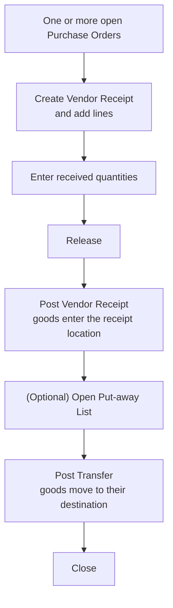

# Vendor Receipts

A **Vendor Receipt** is a goods-inwards worksheet. When a delivery arrives from a
supplier, warehouse staff use it to record what physically came in (per the packing
slip), match it against one or more open **Purchase Orders**, and then post the
receipt to bring the goods into stock.

After the goods have been received, an optional **Put-away List** tells staff where
each received quantity should go — to a bin, a work order, a sales order, or onward
via a transfer — and posting that list moves the stock to its destination.

---

## Two posting steps

A Vendor Receipt involves **two separate posting actions**, and the order matters:

1. **Post the Vendor Receipt** — receives the goods into the **receipt location**.
2. **Post the Put-away Transfer** — relocates the received goods to their final
   destination.

> **Always post the Vendor Receipt before posting the Put-away Transfer.** The
> put-away moves stock *out of* the receipt location, so that stock has to be there
> first. Posting the put-away before the receipt can fail, or — depending on your
> item and location settings — create negative inventory that has to be cleaned up
> later. See [Put-away List](PutAwayList.md) for details.

---

## Status lifecycle

A Vendor Receipt moves through four statuses:

| Status | Meaning |
|---|---|
| **Open** | The document is editable. You can add and change lines. |
| **Released** | Pre-posting checks have passed. The header and lines are now locked for editing. |
| **Posted** | The goods have been received into stock. The receipt now appears in the posted (history) view. |
| **Closed** | A manual final state once the receipt is fully handled. |

You can post directly from **Open** — the system will release the document first
(after a confirmation). If posting fails partway through, the document is reopened
so you can correct it.

---

## How it fits together

---

## In this section

- **[Create a Vendor Receipt](CreateVendorReceipt.md)** — start the document and add
  the lines you are receiving.
- **[Release and Post a Vendor Receipt](ReleaseAndPostVendorReceipt.md)** — run the
  pre-posting checks, receive the goods, and handle shortages or damage as claims.
- **[Put-away List](PutAwayList.md)** — generate the put-away worklist and move the
  received goods to their destination.
- **[Field Reference](FieldReference.md)** — what each field on the header and lines
  means.
